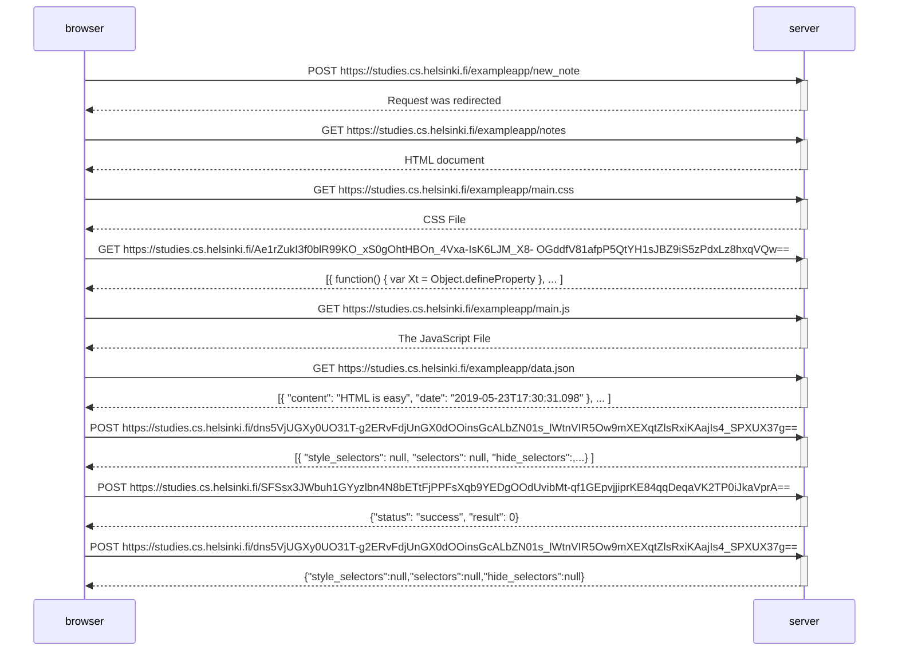

```mermaid
sequenceDiagram
    participant browser
    participant server
    
    browser->>server: POST https://studies.cs.helsinki.fi/exampleapp/new_note
    activate server
    server-->>browser: Request was redirected
    deactivate server
    
    browser->>server: GET https://studies.cs.helsinki.fi/exampleapp/notes
    activate server
    server-->>browser: HTML document
    deactivate server

    browser->>server: GET https://studies.cs.helsinki.fi/exampleapp/main.css
    activate server
    server-->>browser: CSS File
    deactivate server
    
    browser->>server: GET https://studies.cs.helsinki.fi/Ae1rZukI3f0blR99KO_xS0gOhtHBOn_4Vxa-IsK6LJM_X8- OGddfV81afpP5QtYH1sJBZ9iS5zPdxLz8hxqVQw==
    activate server
    server-->>browser: [{ function() { var Xt = Object.defineProperty }, ... ]
    deactivate server
    
    browser->>server: GET https://studies.cs.helsinki.fi/exampleapp/main.js
    activate server
    server-->>browser: The JavaScript File
    deactivate server

    browser->>server: GET https://studies.cs.helsinki.fi/exampleapp/data.json
    activate server
    server-->>browser: [{ "content": "HTML is easy", "date": "2019-05-23T17:30:31.098" }, ... ]
    deactivate server

    browser->>server: POST https://studies.cs.helsinki.fi/dns5VjUGXy0UO31T-g2ERvFdjUnGX0dOOinsGcALbZN01s_lWtnVIR5Ow9mXEXqtZlsRxiKAajIs4_SPXUX37g==
    activate server
    server-->>browser: [{ "style_selectors": null, "selectors": null, "hide_selectors":,...} ]
    deactivate server 

    browser->>server: POST https://studies.cs.helsinki.fi/SFSsx3JWbuh1GYyzlbn4N8bETtFjPPFsXqb9YEDgOOdUvibMt-qf1GEpvjjiprKE84qqDeqaVK2TP0iJkaVprA==
    activate server
    server-->>browser: {"status": "success", "result": 0}
    deactivate server

    browser->>server: POST https://studies.cs.helsinki.fi/dns5VjUGXy0UO31T-g2ERvFdjUnGX0dOOinsGcALbZN01s_lWtnVIR5Ow9mXEXqtZlsRxiKAajIs4_SPXUX37g==
    activate server
    server-->>browser: {"style_selectors":null,"selectors":null,"hide_selectors":null}
    deactivate server


```
