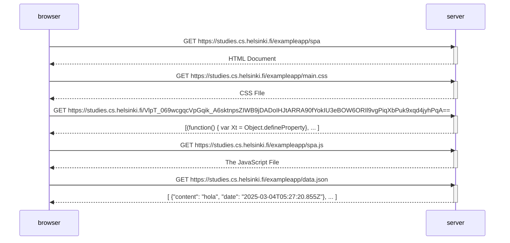

```mermaid
sequenceDiagram
    participant browser
    participant server
    
    browser->>server: GET https://studies.cs.helsinki.fi/exampleapp/spa
    activate server
    server-->>browser: HTML Document
    deactivate server
    
    browser->>server: GET https://studies.cs.helsinki.fi/exampleapp/main.css
    activate server
    server-->>browser: CSS FIle
    deactivate server

    browser->>server: GET https://studies.cs.helsinki.fi/VlpT_069wcgqcVpGqik_A6sktnpsZIWB9jDADoIHJtARRA90fYokIU3eBOW6ORIl9vgPiqXbPuk9xqd4jyhPqA==
    activate server
    server-->>browser: [(function() { var Xt = Object.defineProperty}, ... ]
    deactivate server
    
    browser->>server: GET https://studies.cs.helsinki.fi/exampleapp/spa.js
    activate server
    server-->>browser: The JavaScript File
    deactivate server
    
    browser->>server: GET https://studies.cs.helsinki.fi/exampleapp/data.json
    activate server
    server-->>browser: [ {"content": "hola", "date": "2025-03-04T05:27:20.855Z"}, ... ]
    deactivate server


```
